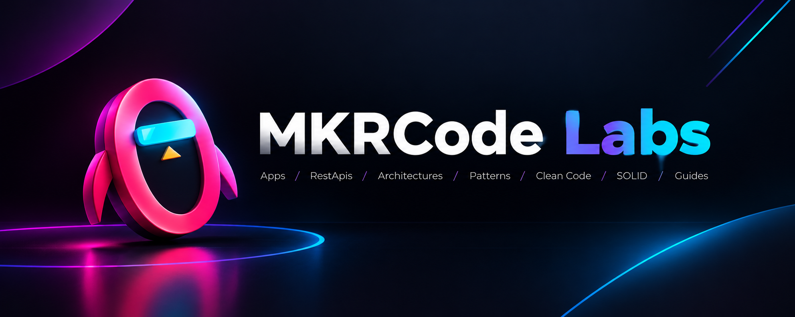

  

## Visión general

MKRCode-Labs es un entorno centralizado para la investigación, desarrollo y prueba de concepto de arquitecturas de software, marcos de trabajo y herramientas tecnológicas. Este espacio está diseñado para albergar repositorios estructurados que abarcan desde análisis de características en nuevas versiones hasta implementaciones de referencia y proyectos de aprendizaje práctico.

---

  
  
  
  
  
  
  
  
  
  
  
  
  
  
  
  
  

---

  <strong><i>Learn. Experiment. Build.</i></strong>

